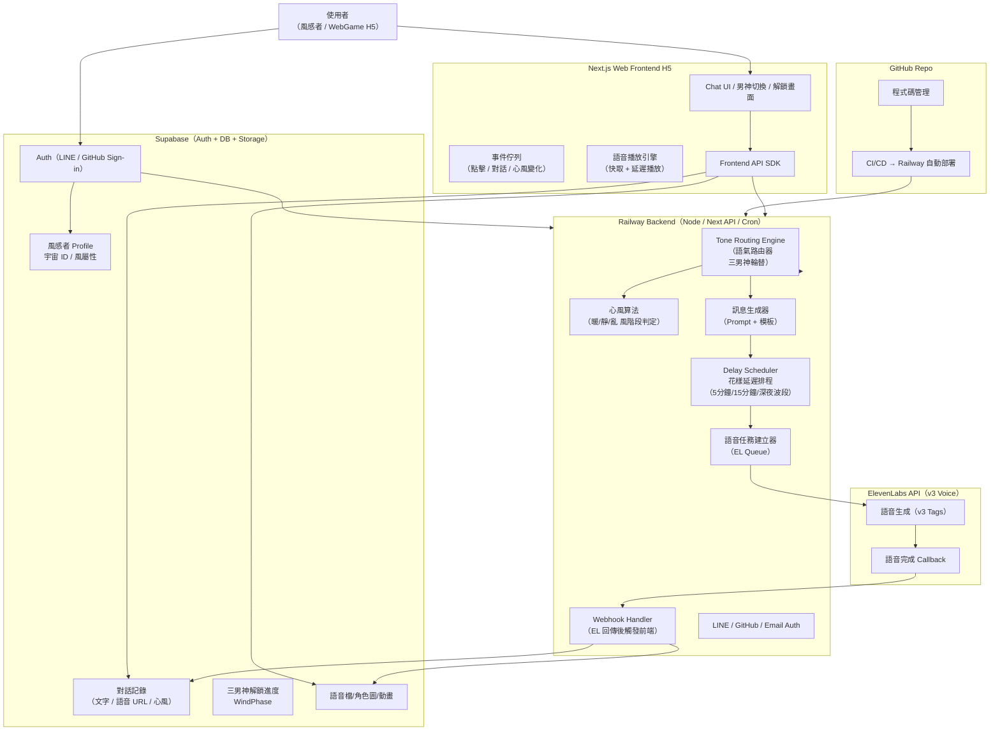
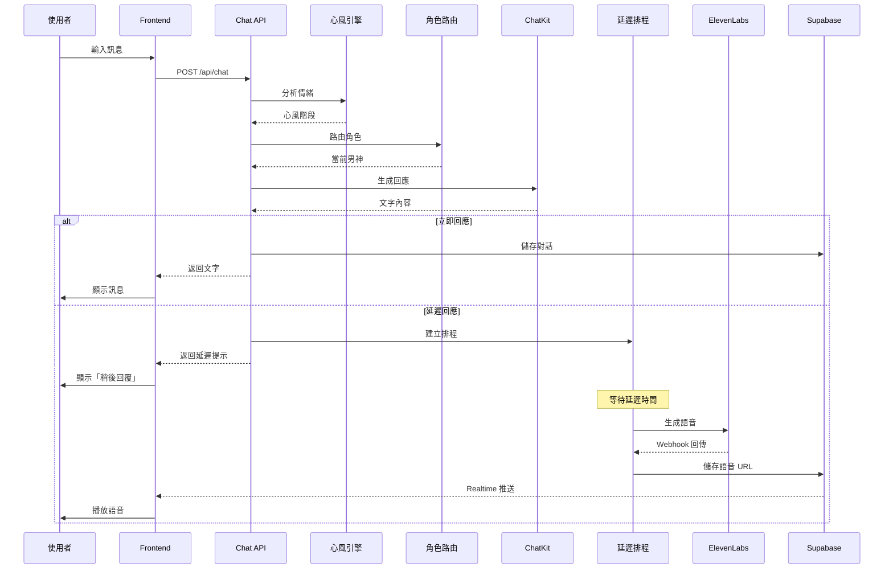
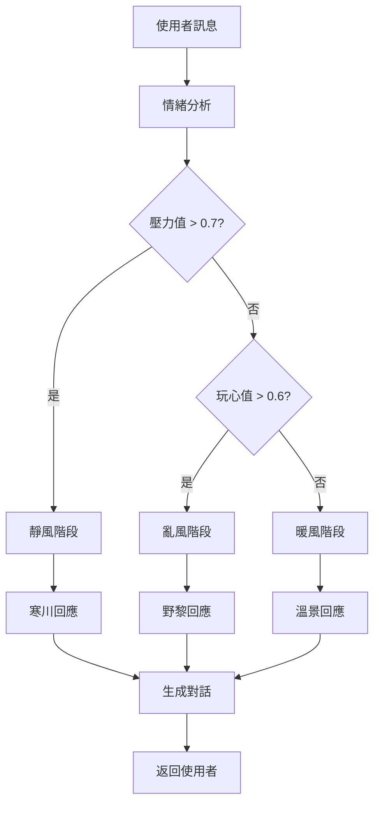
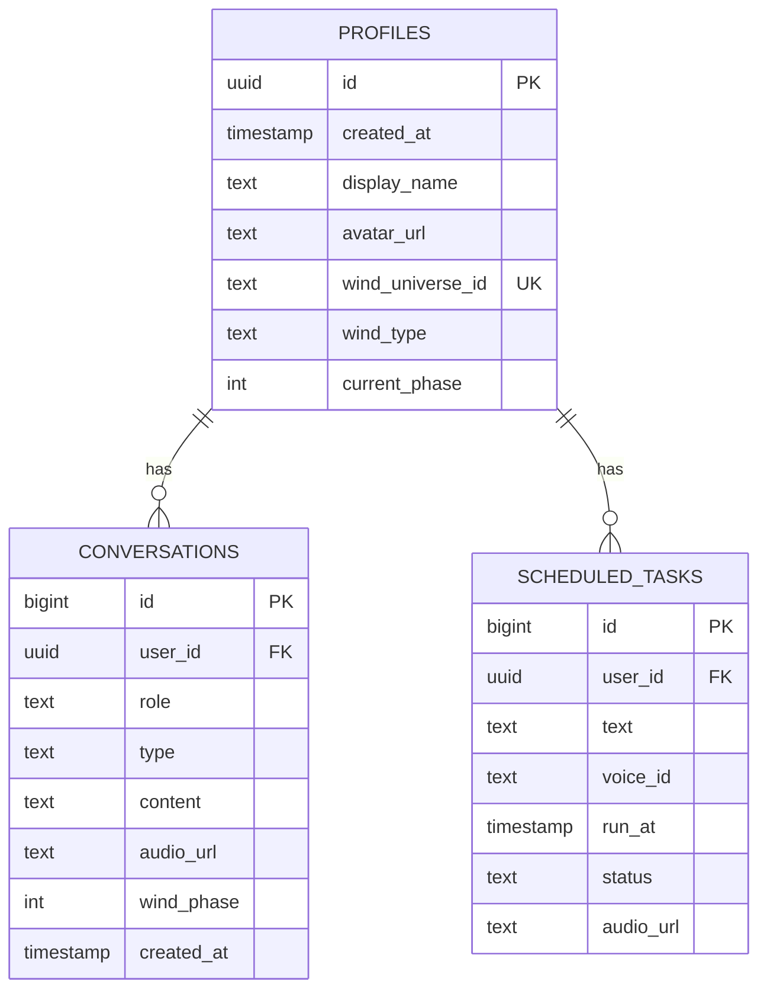
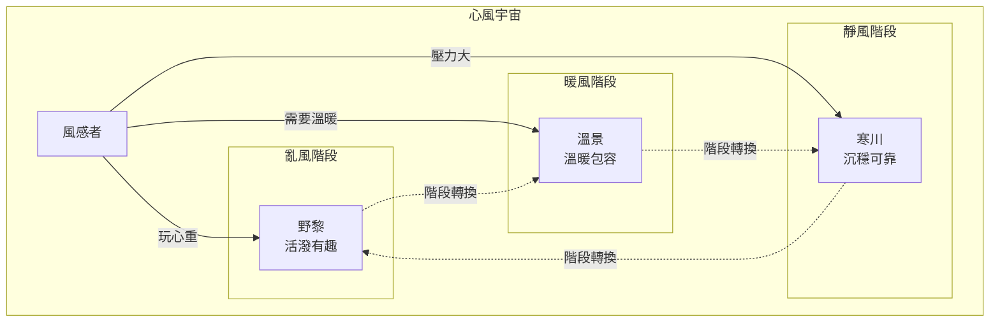
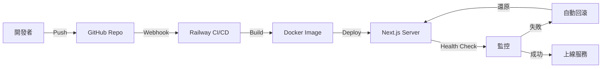
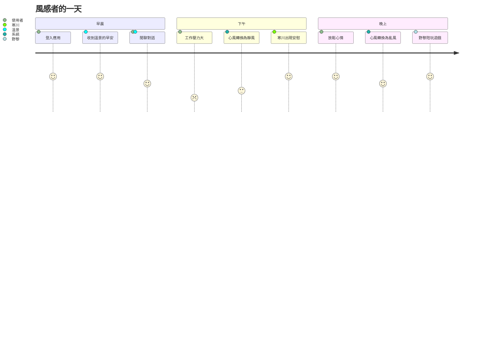
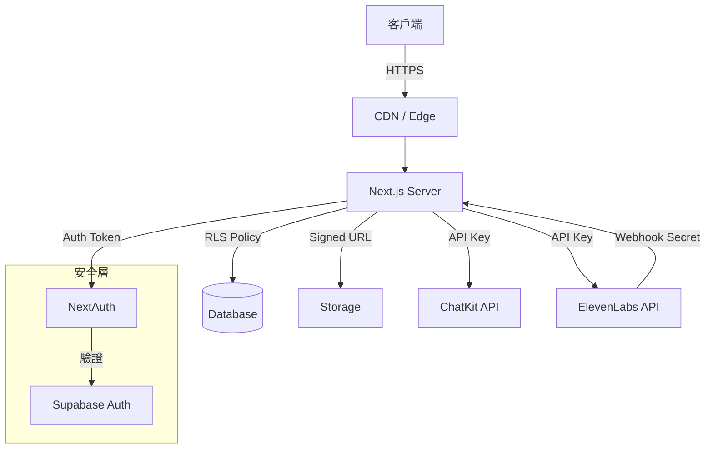

# 🎨 系統視覺化圖表

本文件包含獵風男團專案的各種視覺化圖表，幫助理解系統架構。

---

## 🏗️ 完整技術架構圖

---

## 💬 對話流程圖

---

## 🌬️ 心風算法決策樹

---

## 🗄️ 資料庫 ER 圖

---

## ⏰ 延遲排程時間軸

```mermaid
gantt
    title 延遲訊息排程範例
    dateFormat HH:mm
    axisFormat %H:%M
    
    section 快速回應
    電梯訊號不好 (1-3分鐘)    :a1, 14:00, 3m
    
    section 短延遲
    開會中 (5-10分鐘)         :a2, 14:00, 10m
    開車中 (3-10分鐘)         :a3, 14:00, 8m
    
    section 中延遲
    洗澡 (15-30分鐘)          :a4, 14:00, 25m
    健身 (20-30分鐘)          :a5, 14:00, 30m
    
    section 長延遲
    深夜波段 (3-6小時)        :a6, 14:00, 240m
```

---

## 🎭 三男神角色關係圖

---

## 🔄 CI/CD 部署流程

---

## 📱 使用者體驗流程

---

## 🔐 安全架構圖

---

**所有圖表持續更新中... 🌬️**
