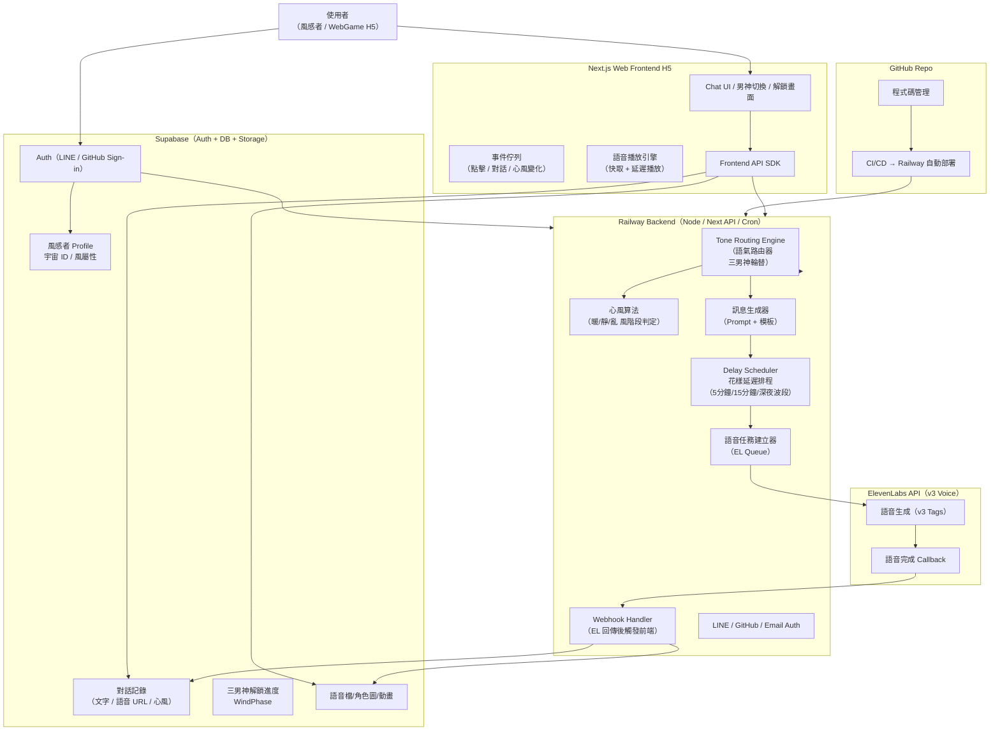

# 🌬️ 獵風男團 · Wind Hunter WebGame

> **Version:** v1.0  
> **Stack:** Next.js + Railway + Supabase + ElevenLabs + ChatKit

一個基於心風算法的互動式 WebGame，三位男神角色（溫景、寒川、野黎）會根據玩家的情緒狀態動態回應，提供沉浸式的語音對話體驗。

---

## 📋 目錄

- [技術架構圖](#-技術架構圖)
- [架構重點解讀](#-架構重點解讀)
- [專案結構](#-專案結構)
- [安裝與開發](#-安裝與開發)
- [環境變數設定](#-環境變數設定)
- [ChatKit 集成指引](#-chatkit-集成指引)
- [資料庫 Schema](#-資料庫-schema)
- [核心系統說明](#-核心系統說明)
- [部署流程](#-部署流程)

---

## 🏗️ 技術架構圖



---

## 🧩 架構重點解讀

### 1. **三男神邏輯 = Tone Routing Engine**

- 基於心風算法決定：溫景 / 寒川 / 野黎
- 不固定順序
- 每位玩家是獨立宇宙 → 不互相干擾
- Router 接收情緒 → 回傳當前男神

### 2. **花樣延遲 = Delay Scheduler**

支援多種延遲情境：

- 「開會中，5分鐘回妳」
- 「我在開車，稍等一下」
- 「電梯訊號不好」
- 「我15分鐘後回妳喔，寶貝」

技術實現：

- Railway cron-like worker
- 每個事件是佇列
- 支援取消 / 修改

### 3. **語音生成 + 回傳 = ElevenLabs Webhook**

- 前端不等語音，先收到文字
- 語音完成後透過 webhook 推送到 Storage
- 前端自動更新語音泡泡

### 4. **全部使用 Supabase（超乾淨）**

- Auth（Line, GitHub, Email）
- Realtime（pending 語音事件）
- Postgres（記錄宇宙 & 心風）
- Storage（語音/圖片）

### 5. **H5 WebGame → 最快上市，不用 App 審核**

- 以 Next.js export 或 edge runtime
- 體驗像 APP，但更快迭代
- 未來可套 shell 做成 App（Capacitor）

---

## 📦 專案結構

```
/app
  /api
    /chat               # 三男神對話 API
    /voice-webhook      # ElevenLabs 完成回調
  /wind                 # 風感者宇宙主頁
  /auth                 # LINE / GitHub 登入
/components
/lib
  /wind-engine          # 心風算法
  /tone-router          # 三男神路由
  /delay-scheduler      # 花樣延遲
  /chatkit              # ChatKit JS SDK 集成
/supabase
  schema.sql
.env.example
README.md
```

---

## ⚡ 安裝與開發

### Clone 專案

```bash
git clone https://github.com/your-org/wind-hunter.git
cd wind-hunter
```

### 安裝依賴

```bash
pnpm install
# 或 npm / yarn
```

### 本地啟動

```bash
pnpm dev
```

開啟瀏覽器訪問 [http://localhost:3000](http://localhost:3000)

---

## 🔑 環境變數設定

複製 `.env.example` 為 `.env.local` 並填入以下變數：

### 🟦 Supabase

```env
NEXT_PUBLIC_SUPABASE_URL=
NEXT_PUBLIC_SUPABASE_ANON_KEY=
SUPABASE_SERVICE_KEY=
```

### 🟧 Railway / Next.js Server

```env
NEXTAUTH_SECRET=
NEXT_PUBLIC_SITE_URL=http://localhost:3000
```

### 🟪 LINE Login v2.1

（若需要 LINE 登入功能）

```env
LINE_CHANNEL_ID=
LINE_CHANNEL_SECRET=
LINE_REDIRECT_URI=https://your-domain.com/api/auth/callback/line
```

### 🟨 ElevenLabs（v3 Voice）

```env
ELEVENLABS_API_KEY=
VOICE_ID_WENJING=
VOICE_ID_HANCHUAN=
VOICE_ID_YELI=
ELEVENLABS_WEBHOOK_SECRET=
```

### 🟩 OpenAI ChatKit 集成

```env
CHATKIT_API_KEY=
CHATKIT_PROJECT_ID=
CHATKIT_WS_URL=
CHATKIT_BASE_URL=
```

### 🔷 Cron / Scheduler

```env
DELAY_QUEUE_SECRET=
```

---

## 🧊 ChatKit 集成指引

> 官方 SDK：[https://github.com/openai/chatkit-js](https://github.com/openai/chatkit-js)

### 安裝 SDK

```bash
pnpm add @openai/chatkit
```

### 建立 ChatKit Client

**檔案：** `lib/chatkit/client.ts`

```typescript
import { ChatKit } from "@openai/chatkit";

export const chatkit = new ChatKit({
  apiKey: process.env.CHATKIT_API_KEY!,
  projectId: process.env.CHATKIT_PROJECT_ID!,
});
```

### 三男神訊息生成

**檔案：** `lib/chatkit/generate.ts`

```typescript
export async function generateWindMessage({ role, userState, prompt }) {
  const stream = await chatkit.messages.create({
    model: "gpt-4.1-mini",
    messages: [
      {
        role: "system",
        content: `你是獵風男團角色：${role}。請根據以下心風狀態回覆。
心風階段：${userState.windPhase}
語氣：保持角色一致性，不可提到AI。`
      },
      { role: "user", content: prompt }
    ],
    stream: false,
  });

  return stream.output_text;
}
```

### 語音生成行程（串 ElevenLabs）

**檔案：** `lib/voice/scheduler.ts`

```typescript
import { scheduleVoiceTask } from "@/lib/voice/scheduler";

export async function replyWithDelay({
  role,
  text,
  delayMinutes,
  userId
}) {
  await scheduleVoiceTask({
    userId,
    text,
    voiceId: mapVoice(role),
    delay: delayMinutes * 60 * 1000,
  });
}
```

---

## 🗄️ 資料庫 Schema

**檔案：** `supabase/schema.sql`

```sql
-- 使用者
CREATE TABLE profiles (
  id UUID PRIMARY KEY,
  created_at TIMESTAMP DEFAULT NOW(),
  display_name TEXT,
  avatar_url TEXT,
  wind_universe_id TEXT, -- 每人一個獨立宇宙
  wind_type TEXT,        -- 初始風屬性
  current_phase INT DEFAULT 1  -- 三男神解鎖階段
);

-- 對話紀錄
CREATE TABLE conversations (
  id BIGSERIAL PRIMARY KEY,
  user_id UUID REFERENCES profiles(id),
  role TEXT,     -- wenjing | hanchuan | yeli | user
  type TEXT,     -- text | audio
  content TEXT,
  audio_url TEXT,
  wind_phase INT,
  created_at TIMESTAMP DEFAULT NOW()
);

-- 任務/排程（延遲語音）
CREATE TABLE scheduled_tasks (
  id BIGSERIAL PRIMARY KEY,
  user_id UUID REFERENCES profiles(id),
  text TEXT,
  voice_id TEXT,
  run_at TIMESTAMP,
  status TEXT DEFAULT 'pending'
);
```

---

## 🔧 核心系統說明

### 🌬️ 心風算法（WindPhase Engine）

**檔案：** `lib/wind-engine/index.ts`

```typescript
export function computeWindPhase(userEmotion) {
  if (userEmotion.stress > 0.7) return 2;   // 寒川：靜風
  if (userEmotion.playful > 0.6) return 3;  // 野黎：亂風
  return 1;                                 // 溫景：暖風
}
```

> 未來可接入 Gemini / OpenAI Emotion API 進行更精準的情緒分析

### 🎭 三男神 Tone Routing

**檔案：** `lib/tone-router/router.ts`

```typescript
export function routeCharacter(phase: number) {
  switch (phase) {
    case 1:
      return "wenjing";  // 暖風
    case 2:
      return "hanchuan"; // 靜風
    case 3:
      return "yeli";     // 亂風
  }
}
```

### 🕒 花樣延遲系統（Delay Scheduler）

**檔案：** `lib/delay-scheduler/index.ts`

```typescript
export async function scheduleVoiceTask(payload) {
  const { userId, text, voiceId, delay } = payload;
  await db.insert("scheduled_tasks", {
    user_id: userId,
    text,
    voice_id: voiceId,
    run_at: new Date(Date.now() + delay),
  });
}
```

**Cron Job（每分鐘掃描）：**

```typescript
const dueTasks = await db
  .from("scheduled_tasks")
  .select("*")
  .lte("run_at", new Date())
  .eq("status", "pending");
```

### 🔊 ElevenLabs v3 Webhook

**檔案：** `app/api/voice-webhook/route.ts`

```typescript
export async function POST(req) {
  const body = await req.json();
  const audioUrl = body.audio_url;
  const taskId = body.metadata.taskId;

  await db
    .from("conversations")
    .insert({
      user_id: body.metadata.userId,
      role: body.metadata.role,
      type: "audio",
      audio_url: audioUrl
    });

  return NextResponse.json({ ok: true });
}
```

### 🔗 ChatKit + WebSocket（即時訊息）

**檔案：** `lib/chatkit/ws.ts`

```typescript
import { ChatKitWS } from "@openai/chatkit/ws";

export function initChatWS(userId) {
  const ws = new ChatKitWS({
    projectId: process.env.CHATKIT_PROJECT_ID!,
    userId,
  });

  ws.on("message", (msg) => {
    console.log("incoming msg:", msg);
  });

  return ws;
}
```

---

## 🚀 部署流程

### Railway 部署步驟

1. **連接 GitHub Repo**
   - 在 Railway 控制台連接此專案的 GitHub repository

2. **設定環境變數**
   - 將上述所有環境變數加入 Railway 專案設定

3. **啟用 Auto Deploy**
   - 每次推送到 main 分支自動部署

4. **加上 Cron Worker**
   ```
   */1 * * * * node dist/cron/scheduler.js
   ```

### 驗證部署

- 檢查 Railway logs 確認服務正常啟動
- 測試 API endpoints
- 驗證 webhook 接收正常

---

## 🌌 功能範圍

本專案包含以下核心功能：

- ✅ 三男神聊天系統
- ✅ 心風算法引擎
- ✅ 延遲語音排程
- ✅ ChatKit 文字生成
- ✅ ElevenLabs 語音合成
- ✅ WebGame H5 介面
- ✅ 多宇宙敘事系統
- ✅ LINE / GitHub 登入整合

---

## 📝 授權

MIT License

---

## 🤝 貢獻

歡迎提交 Issue 和 Pull Request！

---

**Made with 🌬️ by Wind Hunter Team**
